# UIComponents

[](https://swift.org/package-manager/)
[](https://github.com/f-ewald/swift-components/releases)
[](https://swift.org)

A Swift Package providing reusable SwiftUI components for iOS 18+, macOS 15+, and watchOS 11+. The package is split into two libraries:

- **SharedComponents** — Platform-agnostic views and utilities
- **UIComponents** — iOS/macOS-specific views (includes UIKit-dependent features)

## Installation

Add the package to your `Package.swift`:

```swift
dependencies: [
    .package(url: "https://github.com/f-ewald/swift-components.git", from: "1.0.0")
]
```

Then add the libraries you need to your target:

```swift
.target(
    name: "YourApp",
    dependencies: ["SharedComponents", "UIComponents"]
)
```

## SharedComponents

### TipOfTheDayView

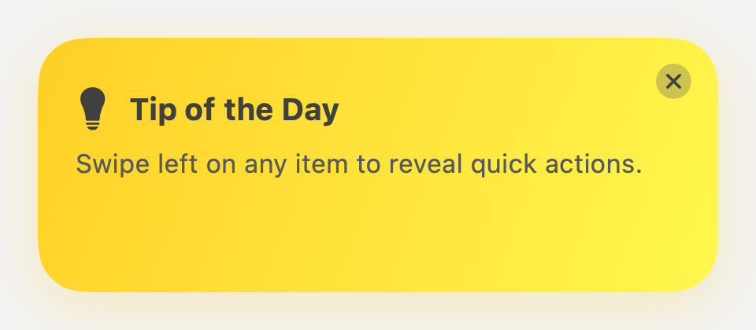

A dismissible tip card with a gradient background. Supports an optional auto-close timer that displays a circular countdown animation around the close button.

```swift
@State private var showTip = true

TipOfTheDayView(
    message: "Swipe left on any item to reveal quick actions.",
    isVisible: $showTip
)
```

With auto-close after 5 seconds:

```swift
TipOfTheDayView(
    message: "This tip will dismiss automatically.",
    isVisible: $showTip,
    autoCloseAfter: .seconds(5)
)
```

### TipOfTheDay / TipOfTheDayService

A SwiftData model plus a service for syncing a bundled JSON file of tips into the model context and picking one to show. Pairs naturally with `TipOfTheDayView` above.

Bundle a `tips_of_the_day.json` file in your app:

```json
{
    "version": "1",
    "tips": [
        { "id": "swipe-actions", "message": "Swipe left on any item to reveal quick actions." },
        { "id": "dark-mode", "message": "Switch themes anytime from Settings." }
    ]
}
```

Then, at app startup:

```swift
import SwiftData

let context: ModelContext = ... // your app's SwiftData context

// Insert new tips / update existing tips' text; never overwrites isShown or deletes tips.
TipOfTheDayService.syncTips(from: "tips_of_the_day", modelContext: context)

// Pick a tip that hasn't been shown yet.
if let tip = TipOfTheDayService.randomUnshownTip(modelContext: context) {
    // present it with TipOfTheDayView(message: tip.message, isVisible: ...)
    TipOfTheDayService.markAsShown(tip, modelContext: context)
}
```

### CloudSettings / CloudStorage

A base class and property wrapper for syncing settings via iCloud key-value storage.

```swift
class MySettings: CloudSettings {
    @CloudStorage("theme", default: "light") var theme: String
    @CloudStorage("fontSize", default: 14) var fontSize: Int
}

struct SettingsView: View {
    @StateObject private var settings = MySettings()

    var body: some View {
        Picker("Theme", selection: $settings.theme) {
            Text("Light").tag("light")
            Text("Dark").tag("dark")
        }
    }
}
```

`CloudStorage` supports primitive types (`String`, `Int`, `Double`, `Bool`, `Data`) and `RawRepresentable` enums whose raw value is a plist type.

### LogoVersionView

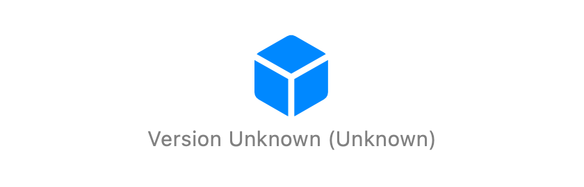

Displays an app logo with the version and build number read from the main bundle.

```swift
// Using an image asset
LogoVersionView(logo: "AppIcon")

// Using a custom view
LogoVersionView {
    Image(systemName: "star.fill")
        .foregroundStyle(.yellow)
}
```

### HeroView

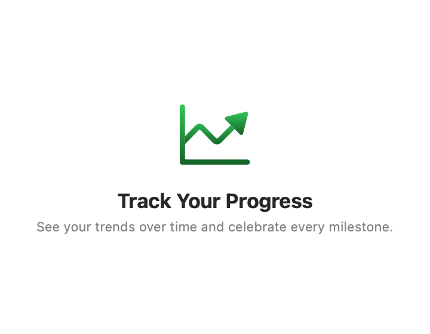

A centered title/icon/description layout, useful for empty states or feature highlights.

```swift
HeroView(
    title: "Track Your Progress",
    systemName: "chart.line.uptrend.xyaxis",
    description: "See your trends over time and celebrate every milestone."
)
```

`description` is optional — omit it for just a title and icon.

### RatingsView / AppLaunchState

Prompts for an App Store review after a set number of launches.

```swift
struct ContentView: View {
    @State private var appLaunchState = AppLaunchState()

    var body: some View {
        VStack {
            // Your content
        }
        .environment(appLaunchState)
        .overlay { RatingsView() }
        .onAppear { appLaunchState.launchCount += 1 }
    }
}
```

### PowerUserView

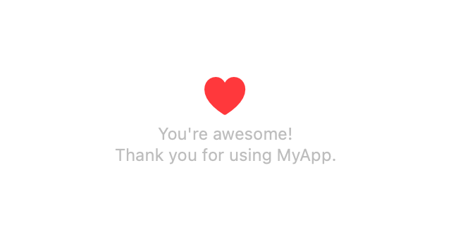

An easter-egg view that shows a pulsing heart animation with an appreciation message.

```swift
PowerUserView(appName: "MyApp")
```

### StatusBannerView

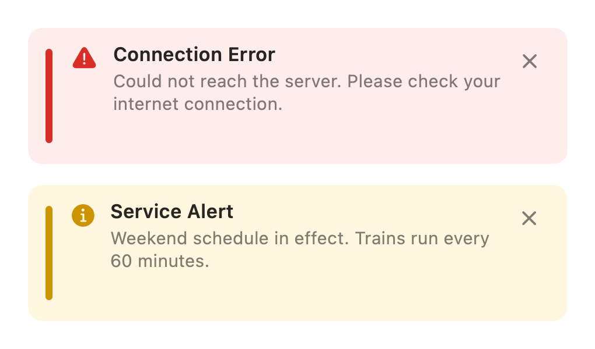

An inline banner for error or info messages, designed to sit inside a `List`. Adapts to light/dark mode automatically.

```swift
@State private var showError = true

List {
    StatusBannerView(
        title: "Connection Error",
        message: "Could not reach the server.",
        style: .error,
        isVisible: $showError
    )

    StatusBannerView(
        title: "Service Alert",
        message: "Weekend schedule in effect.",
        style: .info,
        isVisible: $showError,
        isDismissable: false
    )

    Text("Your regular content")
}
```

`message` and `isDismissable` are optional (default `nil` and `true`, respectively).

### Error Alert

A view modifier for presenting error alerts from an optional string binding.

```swift
@State private var errorMessage: String?

VStack {
    Button("Do something") {
        errorMessage = "Something went wrong"
    }
}
.errorAlert(message: $errorMessage)
```

### Service Alerts

A closure-driven, unopinionated set of views for showing transit service alerts —
navigation/presentation (push, sheet, etc.) is left entirely to the host app.

#### ServiceAlertsView

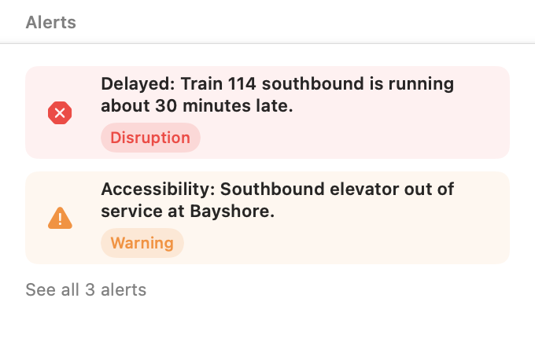

Displays up to `visibleCount` alerts inline (default 2) with a "See all N alerts" row when more exist; designed to be spliced directly into a `List`/`Section` or a plain `VStack`.

```swift
List {
    Section("Alerts") {
        ServiceAlertsView(
            alerts: alerts,
            onSelectAlert: { alert in selectedAlert = alert },
            onShowAllAlerts: { showAllAlerts = true }
        )
    }
}
```

#### ServiceAlertRow

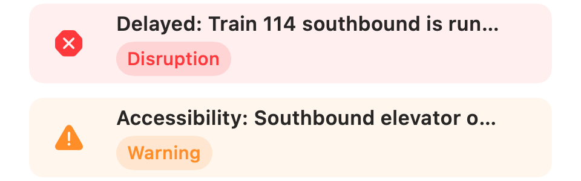

A single alert row with a severity icon, header, and severity badge. If `alert.tags`
is non-empty (e.g. a train number or notification type extracted by an external ML
classifier), a sparkles-prefixed row of tag pills is shown below the severity badge.

```swift
ServiceAlertRow(alert: alert)

// With ML-classified tags:
ServiceAlertRow(alert: ServiceAlert(
    id: alert.id,
    severity: alert.severity,
    header: alert.header,
    description: alert.description,
    tags: ["Train 114", "Delay"]
))
```

#### AllServiceAlertsView

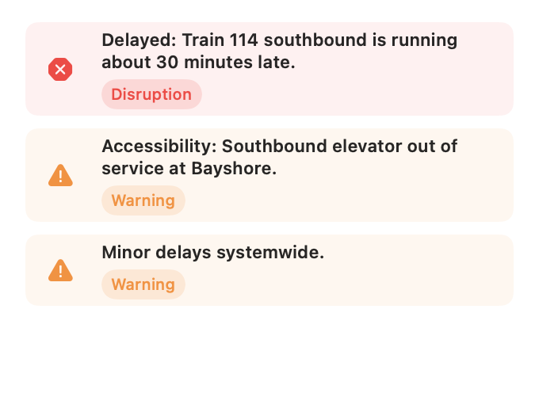

A full scrollable list of every alert, for when there are more than fit inline.

```swift
AllServiceAlertsView(alerts: alerts) { alert in
    selectedAlert = alert
}
```

#### ServiceAlertDetailView

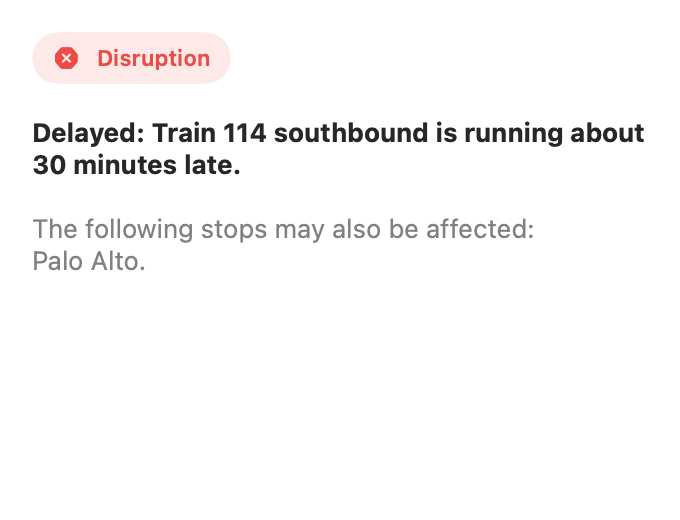

Full detail content for a single alert, including its optional "More Information" link.

```swift
ServiceAlertDetailView(alert: alert)
```

### LocationTracker

An `@Observable`, `@MainActor` class for tracking a device's location over time. Every location received while tracking is appended to `locations`; read `.first`/`.last` for the oldest/most-recent fix. Requesting permission is a separate, explicit step from starting tracking, so you can prompt at the right moment in your UI flow.

```swift
struct MapScreen: View {
    @State private var tracker = LocationTracker()

    var body: some View {
        VStack {
            if tracker.authorizationStatus == .notDetermined {
                Button("Enable Location") {
                    Task { await tracker.requestAuthorization() }
                }
            }
            Text("\(tracker.locations.count) points tracked")
        }
        .onAppear { tracker.start() }
        .onDisappear { tracker.stop() }
    }
}
```

Consuming apps must add `NSLocationWhenInUseUsageDescription` to their own Info.plist — this package can't do that for them.

### Geocoder

A stateless wrapper around reverse geocoding, returning a plain `Address` value instead of `CLPlacemark`.

```swift
let geocoder = Geocoder()
let address = try await geocoder.reverseGeocode(
    coordinate: CLLocationCoordinate2D(latitude: 37.3349, longitude: -122.0090)
)
print(address.locality ?? "", address.administrativeArea ?? "")
```

### Transit Views

Small, agency-agnostic building blocks for transit apps (stations, stops, fare zones, amenities).

#### Amenities


A row of station amenity indicators. Only amenities that are present are shown.

```swift
Amenities(
    parkingSpaces: 42,
    bikeRacks: 12,
    hasRestrooms: true,
    hasElevator: true
)
```

#### BikeIcon / ParkingIcon / RestroomIcon


Pill-styled amenity icons, usable on their own or built into custom layouts with the shared `.transitIconStyle()` modifier.

```swift
HStack {
    BikeIcon()
    ParkingIcon()
    RestroomIcon()
}

// Or apply the same pill styling to your own content:
Text("24/7").transitIconStyle()
```

#### ZoneTextView

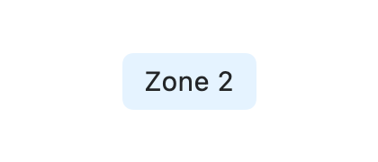

A pill-styled "Zone N" label for transit systems with zone-based fares.

```swift
ZoneTextView(zone: 2)
```

#### TrainLogo


A hand-drawn, front-facing train logo built entirely from SwiftUI shapes — no image assets required. Useful as a brand mark or placeholder icon for rail-oriented transit apps.

```swift
TrainLogo(size: 80, color: .red)
```

## UIComponents

### FeedbackView / FeedbackService

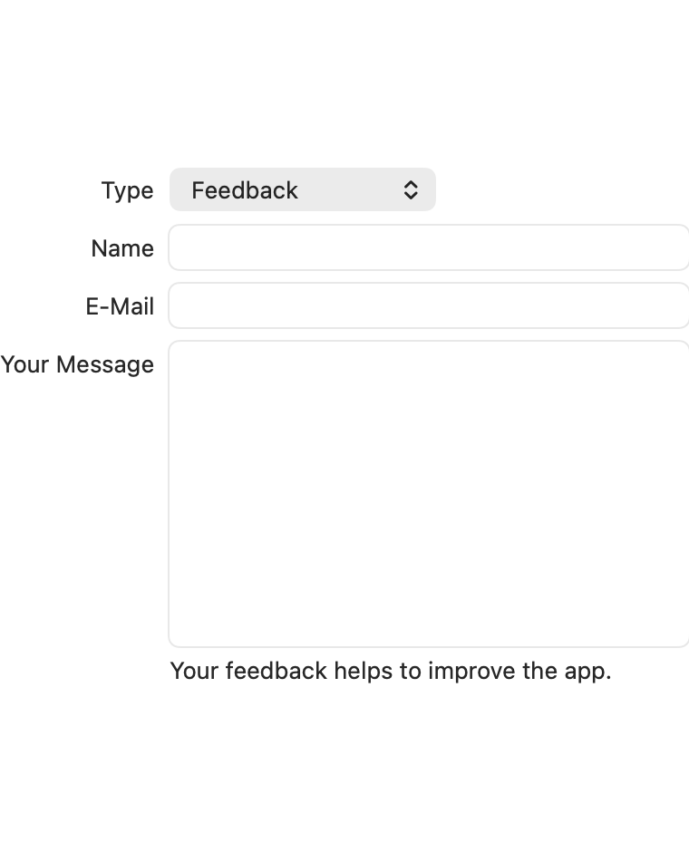

A feedback form with a type picker, name/email/message fields, plus an HTTP service for submitting feedback.

```swift
FeedbackView { feedback in
    let service = FeedbackService(
        url: URL(string: "https://api.example.com/feedback")!
    )
    try await service.send(feedback)
}
```

Pass `onDismiss` too if you need to react to cancellation (e.g. dismissing a wrapping sheet):

```swift
FeedbackView(
    onDismiss: { print("Cancelled") },
    onSend: { feedback in
        Task { try? await service.send(feedback) }
    }
)
```

### Shake Detection (iOS only)

A view modifier that triggers an action when the user shakes the device.

```swift
Text("Shake to undo")
    .onShake {
        print("Device was shaken!")
    }
```

### WizardView / WizardService

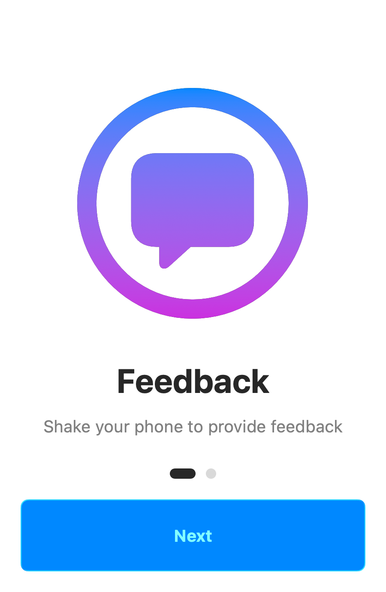

A multi-step onboarding wizard with step indicators and animated transitions. Steps are defined in a bundled `wizard.json` file and loaded through `WizardService`, which also tracks which steps the user has already seen (by app version) so only *new* steps are shown after an update.

Bundle a `wizard.json` file in your app:

```json
{
    "steps": [
        {
            "title": "Feedback",
            "subtitle": "Shake your phone to provide feedback",
            "imageName": "bubble.circle",
            "buttonLabel": "Next",
            "version": "1.0.0"
        },
        {
            "title": "You're all set!",
            "subtitle": "Let's get started",
            "imageName": "checkmark.seal.fill",
            "buttonLabel": "Done",
            "version": "1.0.0"
        }
    ]
}
```

`version` marks the app version a step was introduced in — `WizardService.loadSteps()` only returns steps at or above the last version the user has seen, so re-showing the wizard after an update surfaces just what's new. `imageName` is optional.

```swift
struct ContentView: View {
    @State private var showWizard = WizardService.shouldShowWizard()

    var body: some View {
        VStack {
            // Your content
        }
        .sheet(isPresented: $showWizard) {
            WizardView(steps: WizardService.loadSteps()) {
                WizardService.markCurrentVersionAsSeen()
                showWizard = false
            }
        }
    }
}
```

`gradientColors` is an optional array of `Color` for the step icon's gradient (defaults to blue/purple).

## Requirements

- Swift 6.2+
- iOS 18+ / macOS 15+ / watchOS 11+

## Building & Testing

```bash
swift build
swift test
```
